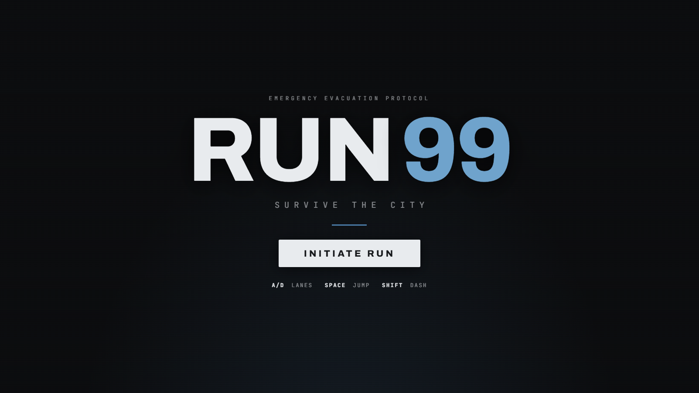
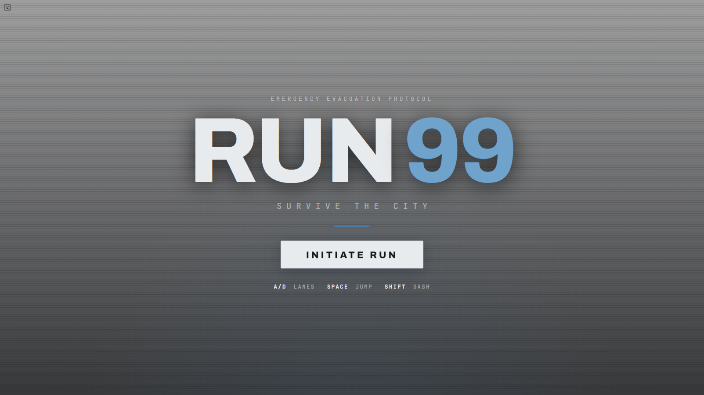
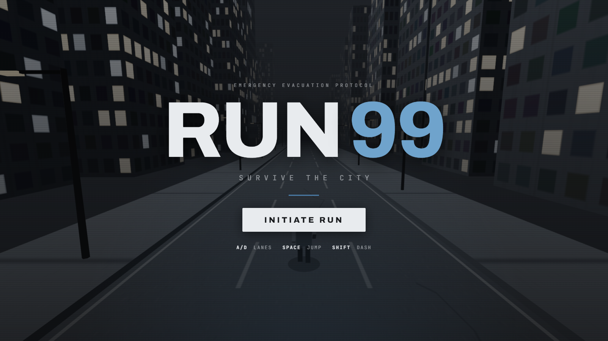

# 🏃‍♂️ RUN 99 — Survive the City

<div align="center">



[](https://run99-f.deploylane.online/)
[](https://threejs.org/)
[](https://greensock.com/)
[](LICENSE)

**An intense 3D WebGL Endless Evacuation Runner built with Three.js & GSAP.**

[🎮 Play Live Game](https://run99-f.deploylane.online/) • [🕹️ Controls](#-controls) • [⚡ Features](#-key-features) • [👨‍💻 About Me](#-about-the-developer)

---

</div>

## 🌌 Overview

**RUN 99** puts you right in the middle of a catastrophic city grid collapse. You have **99 seconds** to reach the extraction zone while navigating hazardous obstacles, unpredictable weather anomalies, blackout zones, and crumbling urban infrastructure.

*Will you survive the extraction timer, or become part of the wreckage?*

---

## 📸 Gameplay Showcase & Screenshots

### 🖥️ Main Evacuation Protocol (Title Screen)


### 🕹️ Active Gameplay & Telemetry HUD


### ⚡ Action In-Motion (Jump & Lane Switch)


---

## 🎥 Gameplay Video & Live Demo

Play the live production build directly in your browser without any installation:

👉 **[Launch RUN 99 on DeployLane](https://run99-f.deploylane.online/)** 🚀

> 💡 *Tip: Turn up your audio and use fullscreen mode for the best immersive cyberpunk evacuation experience!*

---

## ⚡ Key Features

- **⏱️ 99-Second Extraction System**: High-stakes countdown visual rail that ramps up game intensity and threat levels every second.
- **🌧️ Environmental Weather Anomalies**: Dynamic screen-edge environmental effects including Heavy Rain, Power Grid Blackouts, Flash Flooding, and Structural Collapse.
- **🛰️ Tactical Flight HUD**:
  - Real-time **Speedometer** ($m/s$) & **Distance Gauge** ($m$).
  - **Score & Combo Multipliers** ($\times 1.0$ up to max combos on near-misses).
  - **360° Circular Threat Radar** with blip indicators for approaching hazards.
- **🎮 Smooth 3D Controls**: Responsive lane switching, high jumping, and emergency speed dashing.
- **📱 Fully Responsive & Mobile Ready**: Includes custom touch buttons optimized for mobile and tablet touchscreens.

---

## 🕹️ Controls

| Action | Keyboard Control | Mobile Touch Control |
| :--- | :--- | :--- |
| **Move Left / Right** | `A` / `D` or `Left Arrow` / `Right Arrow` | `◄` / `►` Buttons |
| **Jump Over Hazards** | `Spacebar` or `W` / `Up Arrow` | `▲` Button |
| **Emergency Dash** | `Shift` Key | `≫` Button |

---

## 🛠️ Tech Stack & Architecture

- **Rendering Engine**: [Three.js](https://threejs.org/) (WebGL 3D graphics, procedural lighting & materials)
- **Animations**: [GSAP](https://greensock.com/) (GreenSock Animation Platform for fluid UI transitions)
- **Frontend Core**: HTML5, CSS3 Custom Properties, Modern ES6+ JavaScript
- **Deployment Platform**: **DeployLane** (`https://run99-f.deploylane.online/`)

---

## 🚀 Running Locally

1. **Clone the Repository**:
   ```bash
   git clone https://github.com/Jatinnn-ui/run99-f.git
   cd run99-f
   ```

2. **Serve the Application**:
   You can serve the directory using any static web server:
   ```bash
   # Using Python
   python -m http.server 8000
   
   # Or using Node npx serve
   npx serve .
   ```

3. **Open in Browser**:
   Navigate to `http://localhost:8000` to start playing!

---

## 👨‍💻 About the Developer

<div align="center">

### **Jatin (Jatinnn-ui)**
*Full-Stack Developer & WebGL Interactive Graphics Developer*

[](https://github.com/Jatinnn-ui)
[](https://run99-f.deploylane.online/)

---

Hi! 👋 I'm **Jatin**, a passionate developer dedicated to creating immersive web experiences, high-performance 3D WebGL applications, and modern web architectures. 

**RUN 99** was designed and built as a high-octane 3D browser game and deployed on **DeployLane**.

Feel free to check out the project, test your survival time, and connect on GitHub! 🌟

</div>

---

<div align="center">

Made with ❤️ by [Jatin](https://github.com/Jatinnn-ui) | Deployed on [DeployLane](https://run99-f.deploylane.online/)

</div>